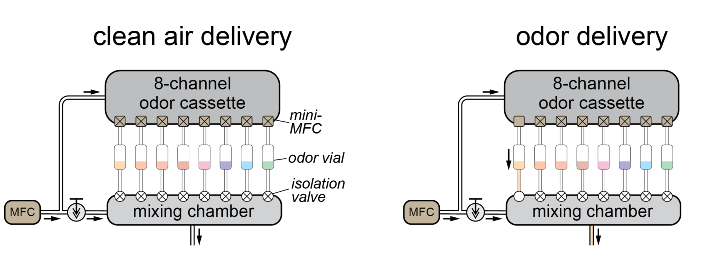
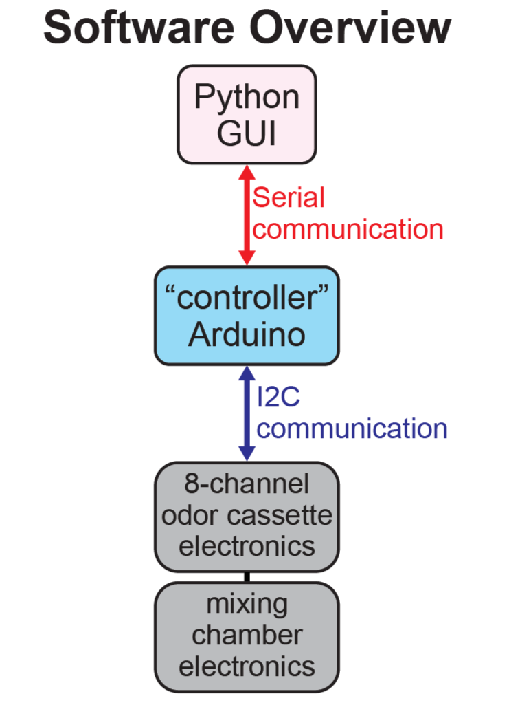

# 8-line Olfactometer + Mixing Chamber

    
    

# Overview
8-channel odor cassette + mixing chamber for controlled odor delivery.

### Hardware:

The system consists of two parts:
- An **8-channel odor cassette** capable of delivering controlled flow through 8 separate odor vials
- A **mixing chamber** for combining odorized air (from the odor cassette) with a clean air stream.

 

The system is structured to deliver 1000 SCCM of air at all times.  

During clean air delivery, all air flows through the mixing chamber.  
During odor delivery, the selected lines on the odor cassette are activated, allowing some of the total quantity of air to flow through the odor vials (thus becoming odorized) and then into the mixing chamber. "Activation" consists of opening the isolation valves on the mixing chamber and turning on the mini-MFC's flow control.

### Software:

The system is controlled by sending serial commands to a "controller" Arduino, which communicates with the elecronics on the rest of the system. Commands can be sent via the Python GUI or manually via the serial port.

 

Further information about the Python GUI can be found [here](https://github.com/tooles01/OlfaControl_GUI/tree/shannon-branch).  
Further information about the serial commands can be found [here](https://github.com/tooles01/OlfaControl_Arduino).  